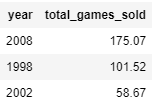

# When Was the Golden Age of Video Games ?

## Description

This analysis was a guided project offered by [DataCamp](https://www.datacamp.com/) to analyze video game critic and user scores as well as sales data for the top 400 video games released since 1977 using ***PostgreSQL***. With the goal of identifying when the ***Golden Age of Video Games*** was by indentifying things such as release years that users and critics liked best, and exploring the business side of games by looking at games sales data. Key SQL skills utilized were joining data, set theory, filtering, grouping and ordering data. 

## Overview & Aim

To gain insights into video game data and establish when **The Golden Age of Video Games** was during the period from 1977 to 2020. 

## Analysis & Findings

1. The favorite year of critics was 1990 with an average critic score of 9.80
2. The favorite year of users was 1997 with an average user score of 9.50
3. Utilizing the set theory `INTERSECT` to extract the years that both critics and users loved I was able to establish that 1998, 2002 & 2008 were the best overall years for games by score.
4. To analyze how the game sales were during these years, I built the following query with set theory inside of a subquery:
```
SELECT
    year,
    SUM(games_sold) AS total_games_sold
FROM game_sales
WHERE year IN (
    SELECT
            year
    FROM top_critic_years_more_than_four_games
    INTERSECT
    SELECT
            year
    FROM top_user_years_more_than_four_games
)
GROUP BY year
ORDER BY total_games_sold DESC;
```
Results were as follows: <br>
 <br>
Taking into consideration our 3 **Golden Age** metrics of average user score, average critic score and games sold, I can make a data driven decision and declare 2008 the Golden **Year** for Games.


## Technology 

* Jupyter Notebook
* Psygopg2 (PostgreSQL adpater for Python)

## Usage

Since the following project is a guided project offered by a paid subscription website, the backend database, connection, user interface & RDMS tool are all hosted on the [DataCamp](https://www.datacamp.com/) website. The corresponding jupyter notebook file cannot be run successfully on it's own as it is not connected to the database in this repository. It is for viewing purposes only.

## License & Ownership

All material and copyrights are property of [DataCamp](https://www.datacamp.com/). Any use of their material is subject to their terms and conditions of service. Access the link to learn more. 